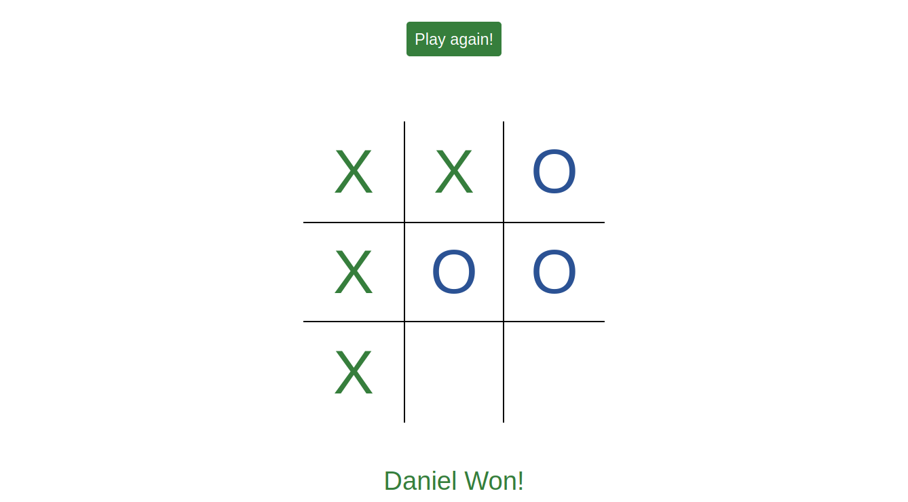

# JsTicTacToe
JavaScript project for creating a Tic-Tac-Toe game on browser.



## Table of Contents

* [Features](#features)
* [Live Demo](#demo)
* [Installation](#installation)
* [Built With](#built-with)
* [Contributing](#contributing)
* [Acknowledgments](#acknowledgments)
* [Authors](#author)
* [License](#license)

## Features
 - A user can add 2 player names to start
 - A user will see messages about who to play and message if it's a tie or there is a winner
 - A user can restart the game with the 'Play Again' button anytime

## Demo

[Live Demo](https://rawcdn.githack.com/Stricks1/JsTicTacToe/ac9f364263f592ad28595b98d95f27b749f347de/index.html)

## Installation

You can get a local copy of the repository please run the following commands on your terminal:
```
$ cd <folder>
$ git clone git@github.com:Stricks1/JsTicTacToe.git
```

## Built With
- Javascript
- HTML
- CSS

## Contributing

Contributions, issues and feature requests are welcome!

You can do it on [issues page](issues/).

## Acknowledgments

Special thanks to code reviewers.

## Show your support

Give a ⭐️ if you like this project!

## Authors

👤 **Daniel Santander**

- Github: [@dansantander](https://github.com/dansantander)
- Linkedin: [Daniel Santander](https://www.linkedin.com/in/daniel-santander)
- Twitter: [@dansantandr](https://twitter.com/dansantandr)

👤 **Gabriel Malheiros Silveira**

- Github: [@Stricks1](https://github.com/Stricks1)
- Linkedin: [Gabriel Silveira](https://linkedin.com/in/gabriel-malheiros-silveira/)
- Twitter: [@Gabriel_Stricks](https://twitter.com/Gabriel_Stricks)

## License

<strong>Creative Commons 2020</strong>
